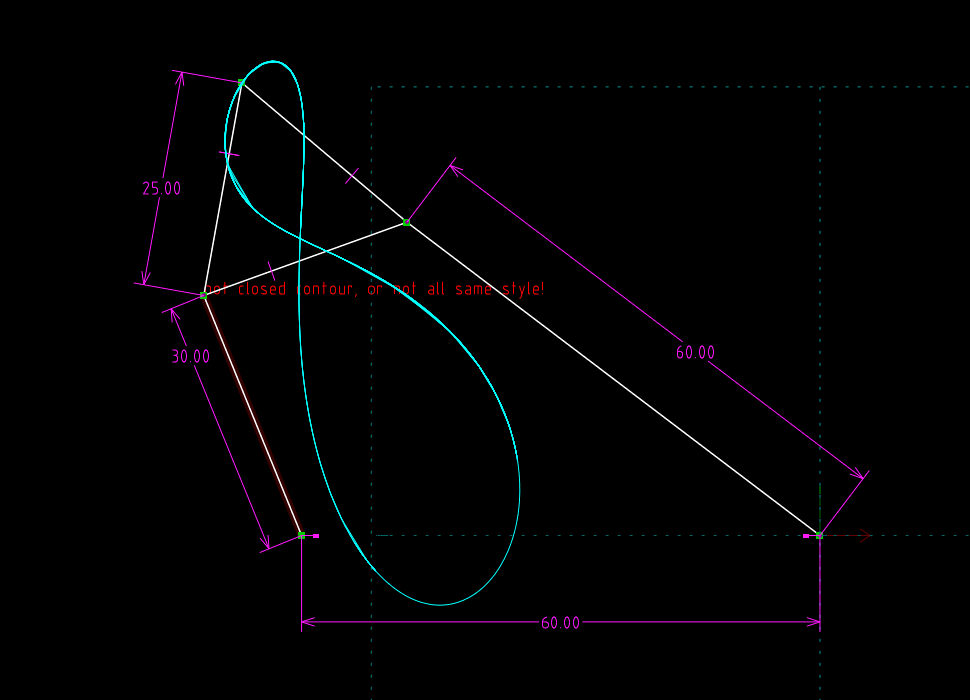

Title: 20170412 第九週
Date: 2017-04-19 11:00
Category: Course
Tags: brython, w9
Slug: Week 9
Author: 40423244

<h3>期中測驗</h3>

<a href="http://mde.tw/2017springcd/blog/midterm-collaboration-evaluation.html">http://mde.tw/2017springcd/blog/midterm-collaboration-evaluation.html </a>

在時間內完成指定事項

<!-- 導入 Brython 標準程式庫 -->

<!-- 啟動 Brython -->

 

 <!-- 以下實際利用  Brython 畫四連桿 trace point 路徑-->
 <canvas id="fourbar_40423244" width="600" height="400"></canvas>

